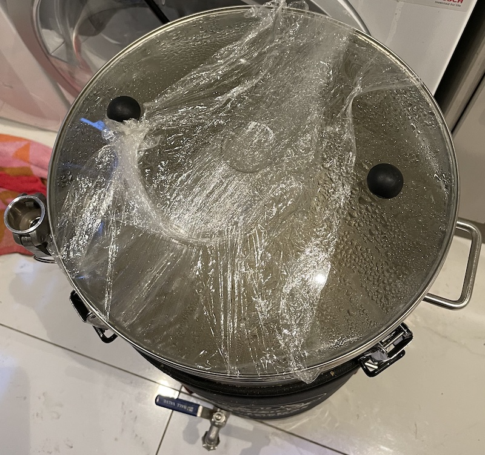
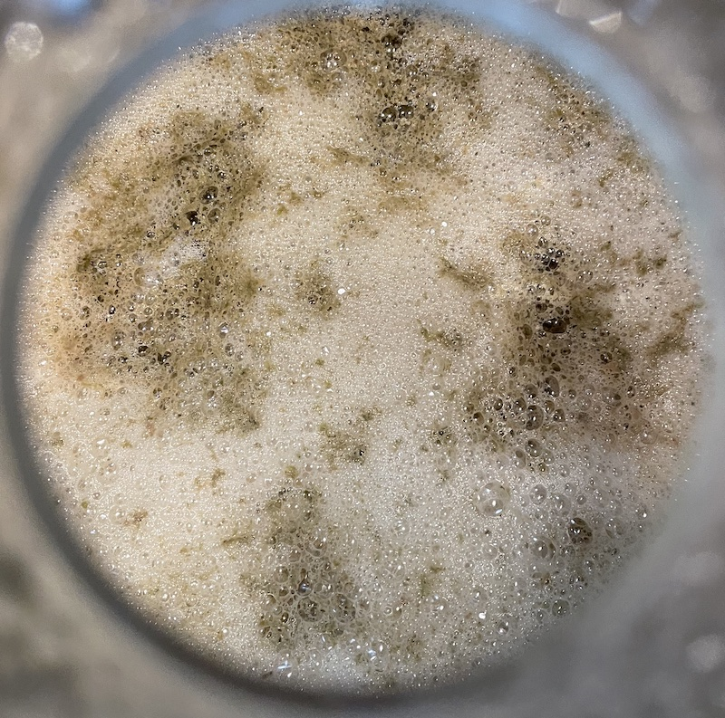
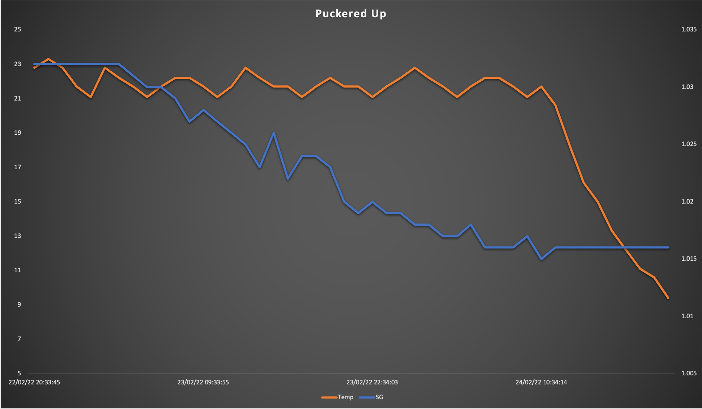
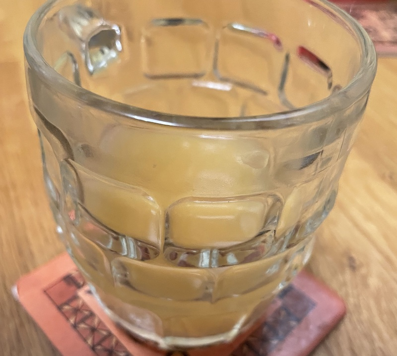

# Puckered-Up

## Ingredients

For a 13 litre batch, as at [Malt Miller](https://www.themaltmiller.co.uk/rg/?id=249291)

| Grain                          | Quantity |
| ------------------------------ | -------- |
| Crisp Clear Extra Pale Malt    | 3000g    |
| Crisp Vienna Malt              | 500g     |
| Crisp Light Muncih Malt        | 500g     |
| Jumbo Oat Flakes               | 500g     |

* Mash water: 21 litres
* Sparge water: 1 litre

| Additions                              | Quantity | Time         |
| -------------------------------------- | -------- | ------------ |
| Saaz Hops                              | 10g      | Start        |
| Saccharomyces Bruxellensis             |          | First Fermentation |

| Additions                              | Quantity | Time         |
| -------------------------------------- | -------- | ------------ |
| Belgian Candi sugar rocks dark         | 500g     | 15           |
| Saaz hops                              | 10g      | 10           |
| Irish Moss                             | 5g       | 5
| Mangrove Jacks Belgian Triple M31 Yeast |          | Second Fermentation |

## Estimates

From [brewers friend](https://www.brewersfriend.com)

| OG    | FG    | Calories     | Carbs         | ABV  | IBU  | SRM  |
| ----- | ----- | ------------ | ------------- |---- | ---- | ---- |
| 1.080 | 1.017 | 265 per 330ml | 25g per 330ml | 8.25% | 8   | 14.6   |

The [BJCP SRM guide](https://www.brewersfriend.com/2017/05/07/beer-styles-srm-color-chart-2017-update/) is an interesting read. It suggests my beer will be a bit too dark for the style, but as long as it tastes nice I'm sure I will cope.

## Process

This is an experiment in kettle souring. It uses exactly the same recipe as [Wim the Third](Wim-the-Third) but with the additional fermentation step.

The method was based on articles [here](https://www.brewuk.co.uk/blog/kettle-souring/) and [here](https://www.homebrewtalk.com/threads/kettle-sour-with-saccharomyces.593438/).

After the mash out the boil was run for just 15 minutes before chilling to 25C and adding a Saccharomyces Bruxellensis yeast starter to the brew kettle. I was able to use the heating element to maintain 25C, but to keep the vessel oxygen free I did a quick purge with CO2 and then wrapper the lid in cling film to try to reduce the airflow.

After 72 hours the kettle was given a further 15 minute boil with the rest of the additions added before once again chilling to 25C, then aerating and transferring to a fermenter and adding the second Belgian yeast.

## Fermentation

For some reason I completely failed to consider that the first yeast would affect the SG so failed to add a hydrometer and so I can't get an accurate ABV. However, given that it was the same recipe as Wim i'd expect the strength to be around the same.

//I actually had to stop it early as it reached my target FG but fermentation looked like it was going to continue. I didn't want the beer to end up too bitter so transferred the fermenter to a fridge to chill it to 4C.

For the second fermentation I used an [Inkbird](https://inkbird.com/products/ibt-310t-b) with a heat mat to regulate the temperature. For a device with only 3 buttons the manual was surprisingly essential reading.

## Actual figures

| Field       | Target         | Actual |
| ----------- | ------------- | ---------- |
| OG          | 1.08      |1.080 (guess)|
| FG          | 1.017      |1.015|
| ABV         | 8.25%    |8.4% (guess)|
| Attenuation | 70%     |82% (guess)|

## Graph

## Kegging
I bought a second, secondhand keg to compare to the new one. it's not as shiny but as long as it can maintain a seal I should be happy.

Kegging process is repeated until I can internalise it:

* Dismantle

* Clean keg, keg bits and tap with cleaner. rinse

* reassemble

* add 5l of sanitiser
* seal
* add co2 and burp
* open tap to purge sanitiser. empty system but don't worry about the foam
* add co2 and burp x3
* remove lid, should now be clean and contain co2
* use auto-siphon to transfer beer, leave siphon tube on base to reduce splashing
* add lid, pull up and regas

The gas level is specific according to temperate and beer style. This [calculator](https://www.brewersfriend.com/keg-carbonation-calculator/  ) helps.

## Tasting notes

Obviously it needs a couple of weeks to condition, nut first sipsays that it's obivously rather hazy, but the sourness is subtle. it almost tastes like a gentle IPA.

## Lessons learnt

* Use hydrometer when fermenting!
* It is important to leave it rest for 48 hours at room tempterature after fermentation has finished, before chilling or gassing. Diacetyl is a natural byproduct of the fermentation process and this time is required to allow the off flavours to be reabsorbed into the yeast.
* Did the sour work? TBD
