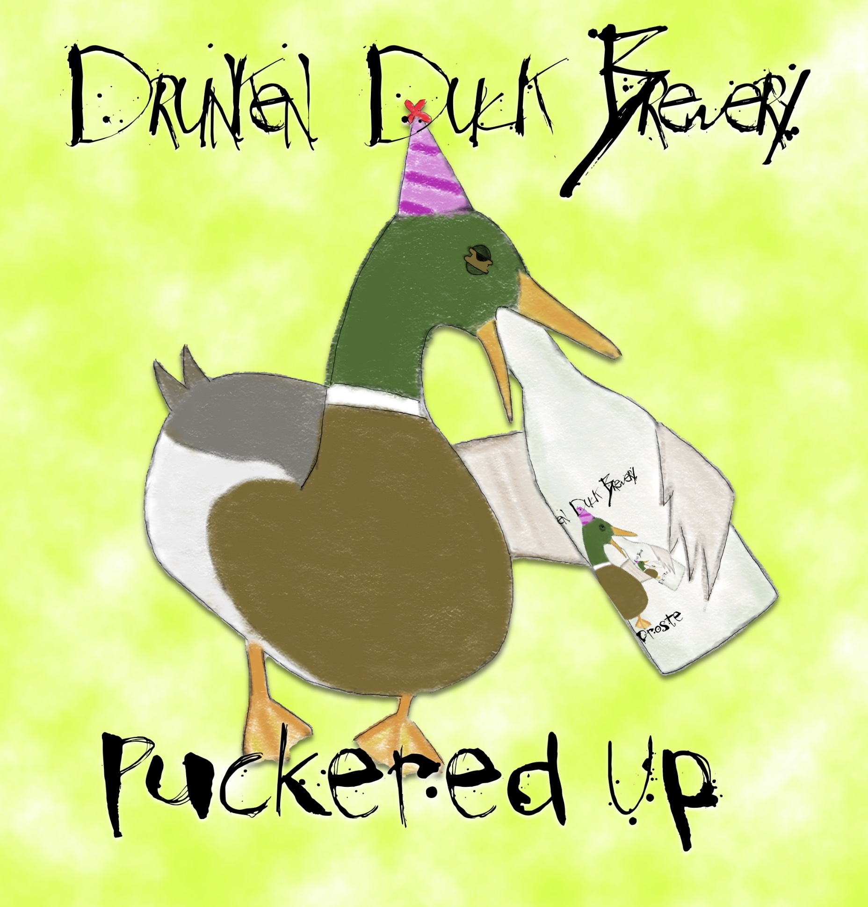

# Puckered-Up

## Ingredients

For a 13 litre batch, as at [Malt Miller](https://www.themaltmiller.co.uk/rg/?id=249291)

| Grain                          | Quantity |
| ------------------------------ | -------- |
| Crisp Clear Extra Pale Malt    | 3000g    |
| Crisp Vienna Malt              | 500g     |
| Crisp Light Munich Malt        | 500g     |
| Jumbo Oat Flakes               | 500g     |

* Mash water: 21 litres
* Sparge water: 1 litre

| Additions                              | Quantity | Time         |
| -------------------------------------- | -------- | ------------ |
| Saaz Hops                              | 10g      | Start        |
| Saccharomyces Bruxellensis             |          | First Fermentation |

| Additions                              | Quantity | Time         |
| -------------------------------------- | -------- | ------------ |
| Belgian Candi sugar rocks dark         | 500g     | 15           |
| Saaz hops                              | 10g      | 10           |
| Irish Moss                             | 5g       | 5
| Mangrove Jacks Belgian Triple M31 Yeast |          | Second Fermentation |

## Estimates

From [brewers friend](https://www.brewersfriend.com)

| OG    | FG    | Calories     | Carbs         | ABV  | IBU  | SRM  |
| ----- | ----- | ------------ | ------------- |---- | ---- | ---- |
| 1.080 | 1.017 | 265 per 330ml | 25g per 330ml | 8.25% | 8   | 14.6   |

The [BJCP SRM guide](https://www.brewersfriend.com/2017/05/07/beer-styles-srm-color-chart-2017-update/) is an interesting read. It suggests my beer will be a bit too dark for the style, but as long as it tastes nice I'm sure I will cope.

## Process

This is an experiment in kettle souring. It uses exactly the same recipe as [Wim the Third](Wim-the-Third) but with the additional fermentation step.

The method was based on articles [here](https://www.brewuk.co.uk/blog/kettle-souring/) and [here](https://www.homebrewtalk.com/threads/kettle-sour-with-saccharomyces.593438/).

After the mash out the boil was run for just 15 minutes before chilling to 25C and adding a Saccharomyces Bruxellensis yeast starter to the brew kettle. I was able to use the heating element to maintain 25C, but to keep the vessel oxygen free I did a quick purge with CO2 and then wrapper the lid in cling film to try to reduce the airflow.

After 72 hours the kettle was given a further 15 minute boil with the rest of the additions added before once again chilling to 25C, then aerating and transferring to a fermenter and adding the second Belgian yeast.

## Fermentation

For some reason I completely failed to consider that the first bacteria fermentation would affect the OG but turning sugar into lactic acid.

After 72 hours I boiled for 15 minutes to stp the first fermentation.

For the second fermentation I used an [Inkbird](https://inkbird.com/products/ibt-310t-b) with a heat mat to regulate the temperature. For a device with only 3 buttons the manual was surprisingly essential reading.

## Actual figures

| Field       | Target         | Actual |
| ----------- | ------------- | ---------- |
| OG          | 1.080      |1.038 |
| FG          | 1.017      |1.015|
| ABV         | 8.25%    |3.0% (guess)|

## Graph

## Kegging
I bought a second, secondhand keg to compare to the new one. it's not as shiny but as long as it can maintain a seal I should be happy.

Kegging process is repeated until I can internalise it:

* Dismantle

* Clean keg, keg bits and tap with cleaner. rinse

* reassemble

* add 5l of sanitiser
* seal
* add co2 and burp
* open tap to purge sanitiser. empty system but don't worry about the foam
* add co2 and burp x3
* remove lid, should now be clean and contain co2
* use auto-siphon to transfer beer, leave siphon tube on base to reduce splashing
* add lid, pull up and regas

The gas level is specific according to temperate and beer style. This [calculator](https://www.brewersfriend.com/keg-carbonation-calculator/  ) helps.

## Tasting notes

Obviously it needs a couple of weeks to condition, but the first taste shows it's hazy and has a slight mount tingle, almost like an IPA. But it's not sour.

## Lessons learnt

* It is important to leave it rest for 48 hours at room temperature after fermentation has finished, before chilling or gassing. Diacetyl is a natural byproduct of the fermentation process and this time is required to allow the off flavours to be reabsorbed into the yeast.
* Souring bacteria affect the SG without changing the alcohol content. ABV calculations are more complicated.
* Kettle souring is complicated.
  * I need to use lactic acid to get the pH optimal for the bacteria.
  * I shouldn't add *any* hops during the first boil, these will affect the bacteria.
  * I could learn a lot for the second attempt by reading blogs from [brewuk](https://www.brewuk.co.uk/blog/kettle-souring/), [homebrewanswers](https://homebrewanswers.com/kettle-sour-brewing/) and [lallemand](https://www.lallemandbrewing.com/docs/products/bp/BEST-PRACTICES_KETTLESOUR_DIGITAL.pdf).

# Puckered Up #2

This is exactly the same brew with the following modifications:
* No hops added in first boil
* The souring bacteria was changed to [Lactobacillus plantarum](https://www.themaltmiller.co.uk/product/wildbrew-sour-pitch/)
* The bacteria requires the pH of the wort to be raised to ~4.6 by adding lactic acid beforehand.

## Actual figures

| Field       | Target         | Actual |
| ----------- | ------------- | ---------- |
| OG          | 1.080      |1.059 |
| FG          | 1.017      |1.011|
| ABV         | 8.25%    |6.3% |

## Graph

## Fermenter
Notice how well regulated the temperature is - that's because i hooked up the inkbird to a heat mat inside a fridge.

## Tasting notes

It's a lot sourer, and a lot stronger. Thing is, the souring bacteria didn't alter the SG at all. It's possible that the sourness comes from the lactic acid I added, not from the bacteria. It's possible that the bacteria didn't work as I jousr added it t the wart without giving it a kick start. Its also possible that I didn't get the starting pH right, the strips I used aren't very accurate.
It tastes like a sour though, a good base to add fruit to.

## Lessons learnt

* I think I need more practice.
* I would benefit from some advice from someone more experienced.
* I need a better way to measure pH, e.g. a [digital pH meter](https://www.themaltmiller.co.uk/product/digital-ph-meter/).
* always start off the baceria or yeast with a bit of sugar in warm water.
